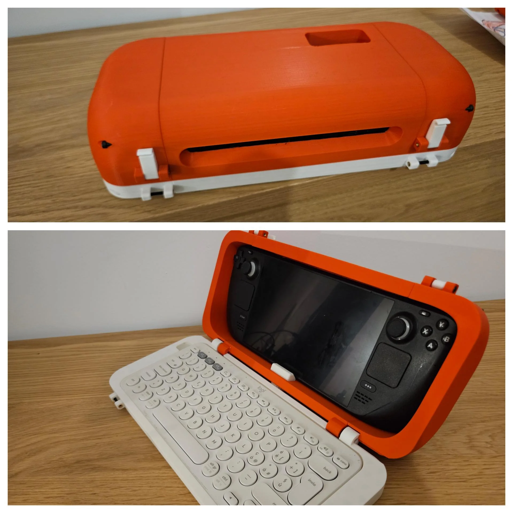

# Steam Deck + Logitech K380 Enclosure

A 3D-printed enclosure that transforms your Steam Deck into a compact, portable laptop.

This project provides a custom-designed enclosure that securely holds both the **Steam Deck** and the **Logitech K380 keyboard**. The dimensions line up perfectly, allowing the two devices to nest together as if they were meant for each other. The result is a clean, lightweight, and highly portable laptop-style setup you can take anywhere.

Whether you're writing, coding, traveling, or just want a more comfortable way to use your Steam Deck for productivity, this enclosure gives the hardware a completely new purpose.

### Features

* Fits the Steam Deck and Logitech K380 with a precise, clean alignment
* Converts your Steam Deck into a functional mini-laptop
* Comfortable typing experience with a full-size portable keyboard
* Easy-to-print parts designed for most consumer 3D printers
* Minimal assembly and no soldering required
* Ideal for writing, note-taking, and lightweight productivity setups

### What's Included

* STL files for all printed parts
* Assembly guide and fit notes
* Optional adjustments for different printing tolerances

### BOM

* Steam Deck
* Logitech K380 keyboard
* 4x M3 hex screws, 60 mm length
* 6x M3 hex screws, 20 mm length
* 10x M3 heat inserts, 3 mm length (OD 4.5 mm)
* Soft cloth material or rubber rings for cushioning

### Assembly Instructions

1. Install the M3 heat inserts into the printed parts and secure them in place.
2. Add soft cloth pieces or rubber rings anywhere the Steam Deck will make contact with the enclosure. This helps prevent scratches and absorb minor impacts.
3. Place the Steam Deck inside the enclosure, ensuring it sits comfortably against the cushioning.
4. Use the display lock and bolts to secure the unit firmly in place.

This setup gives your Steam Deck a more stable fit, offers basic shock absorption, and helps protect the device during handling.

### Press

* [PC Guide - This 3D-printable Steam Deck enclosure comes with space for a keyboard, and it’s free to download](https://www.pcguide.com/news/this-3d-printable-steam-deck-enclosure-comes-with-space-for-a-keyboard-and-its-free-to-download/)
* [Reddit Post](https://www.reddit.com/r/SteamDeck/comments/1phavq6/steam_deck_enclosure/)

### Support

This Steam Deck enclosure project is fully open-source and created out of curiosity, tinkering, and a love for transforming everyday devices into something new. If you've enjoyed printing the enclosure, turning your Steam Deck into a portable laptop, or exploring the design, even a small gesture of support means a lot.

Every contribution helps me keep improving the project and sharing more designs.

* [Buy me a coffee](https://www.buymeacoffee.com/unkyulee)

### Contact

* [Un Kyu Lee's Design Gallery](https://www.yesbut.it/)